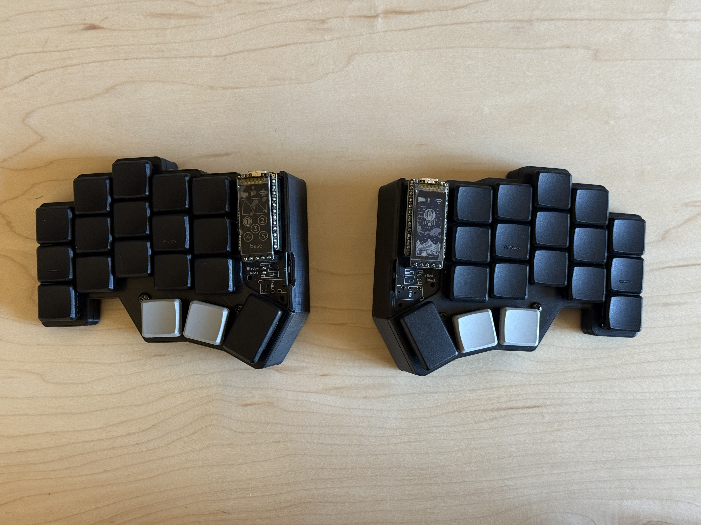
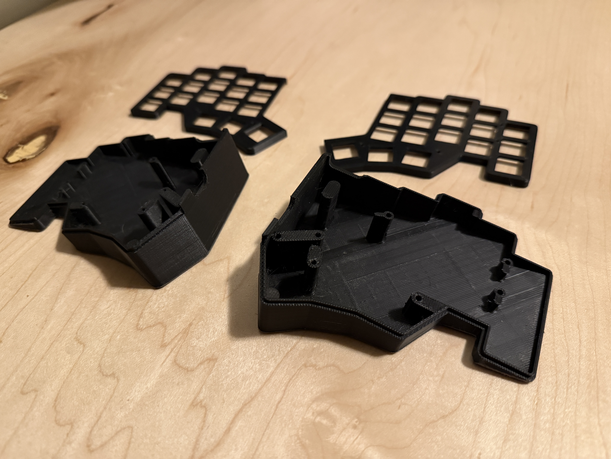
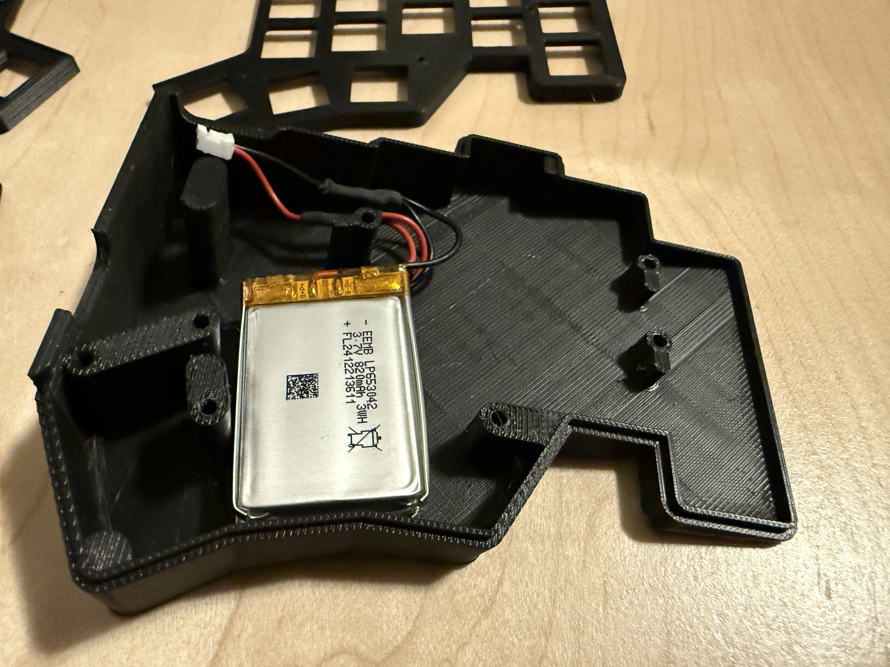
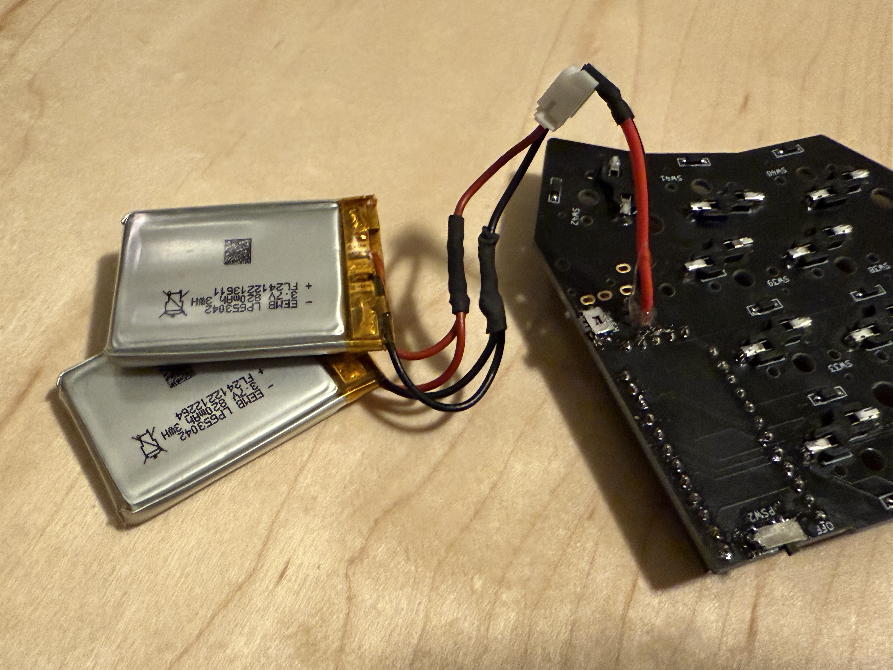
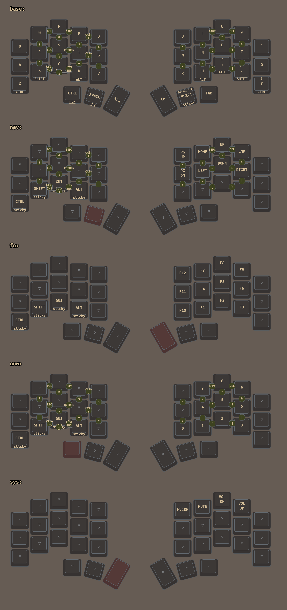

<h1 style="text-align: center;">
  calmak
</h1>

<b>mr-cal's keyboards and configs</b>

## keyboard

I'm using [pashutk](https://github.com/pashutk)'s [chocofi](https://github.com/pashutk/chocofi) keyboard.
I bought an unassembled kit from [beekeeb](https://shop.beekeeb.com/product/chocofi-36-keys-kailh-low-profile-choc-v1-mechanical-ergonomic-hotswap-split-keyboard-diy-kit/).

The only deviation when assembling is the PCB is that I mounted the JST battery connector on the underside. This keeps the battery cable out of sight but requires a tented case. See the battery section below for more details.

## case

I made a few tweaks to the pashutk's case:

* 12.5° tent
* cutouts for power and reset buttons
* display cover

The Solidworks and STL files for the case are in this repo and also on [Thingiverse](https://www.thingiverse.com/thing:6844514).

## batteries

I made the case so it has enough space to fit 2 x 820 mAh batteries in each side. 
I bought this [4 pack of batteries](https://www.amazon.com/dp/B08HJ53Q3C) with dimensions of 30.5mm x 44mm x 6.8mm. 
It is safe to wire batteries in parallel in this scenario as the batteries are all new and from the same manufacturer.

To hide the battery cable, I connected the batteries to the circuit board from the bottom rather than using the JST connector that normally goes on the top of the board.

## layout and keymap

I use the [colemak-dh](http://colemakmods.github.io/mod-dh/) layout instead of qwerty.

Although this project is named is calmak (*mr-cal* + *colemak*), the alpha keys do not diverge from colemak-dh.

## keymap

The layout is based heavily on [urob](https://github.com/urob)'s [zmk config](https://github.com/urob/zmk-config).

urob's base layout is for 34 keys. I have keys on my keyboard and am partial to the 2 extra keys.
For example, I use one of them for`tab`, which gets frequent use at the command line and in combination with modifier keys.

I made a number of simplifications:

* no mouse layer
* no leader key or greek symbols
* no tri-state buttons

I've made many modifications - here are a few:

* home-row mods moved from the home row to the bottom row
* enter and escape combos on the home row
* backspace and delete combos on both halves
* `shift`+`/` = `\`
* `shift`+`-` = `_`

*generated by [keymap-drawer](https://github.com/caksoylar/keymap-drawer)*
